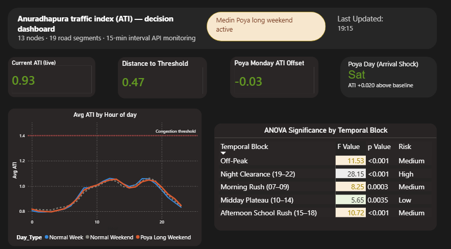
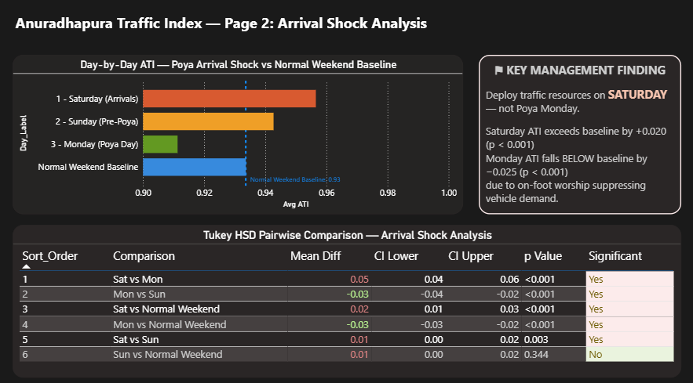
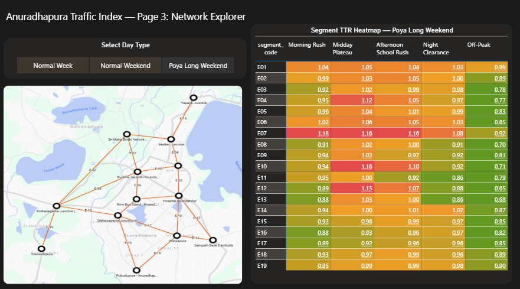

# Anuradhapura Traffic Index (ATI) — Power BI Dashboard

## Overview
A 3-page interactive Power BI dashboard built on top of a 
mathematics seminar research project analysing traffic 
congestion in Anuradhapura UNESCO Heritage City, Sri Lanka.

Data was collected via Google Maps Directions API across 
27,966 observations spanning 13 nodes and 19 road segments 
at 15-minute intervals.

## Dashboard Pages

### Page 1 — Live ATI Monitor

- Current ATI KPI cards with conditional color alerts
- Diurnal ATI line chart — Normal Weekday vs Normal Weekend 
  vs Poya Long Weekend
- ANOVA significance table sorted by F-value

### Page 2 — Arrival Shock Analysis

- Day-by-day ATI bar chart comparing Saturday, Sunday, 
  Monday vs Normal Weekend Baseline
- Tukey HSD pairwise comparison table with conditional 
  formatting
- Key management finding: Deploy resources on Saturday, 
  not Poya Monday

### Page 3 — Network Explorer

- Road network map of 13 nodes and 19 segments
- Segment TTR heatmap (E01-E19 x 5 temporal blocks)
- Green to red gradient showing congestion hotspots

## Key Finding
Saturday is the peak congestion day (+0.020 above baseline,
p < 0.001) not Poya Monday (-0.025 below baseline) due to 
on-foot worship suppressing vehicle demand.

## Tools Used
- Power BI Desktop
- Power Query (data cleaning and transformation)
- DAX (measures and calculations)
- Google Maps Directions API (data source)
- R — ANOVA and Tukey HSD (statistical analysis)

## Files
- ATI_Dashboard.pbix — Power BI project file
- CombinedData.csv — cleaned dataset (driving mode only)

## Data
- Normal week: 16-22 February 2026
- Poya long weekend: 28 Feb - 2 March 2026
- Total observations: 27,966
- Segments: 19 road segments
- Sampling interval: 15 minutes
